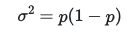

# Error bars for histograms

We can also use the central limit theorem to calculate error bars for histograms.  We can thus avoid resampling our error bar in the way I showed you previously.  In this exercise, we are going to try to write a program that calculates error bars that can be shown on a histogram using the central limit theorem.  Our histogram is going to be an estimate for the probability mass function for a binomial random variable so to complete the exercise you are going to need to:

1. Write a function called `binomial` that takes in two parameters `n` (the number of trials) and `p` (the probability of success in each trial)  This function should return a binomial random variable from a distribution with parameters `n` and `p`.
2. Write a loop that calls the `binomial` function `nsamples` times with `n=5` and `p=0.5` and that accumulates a histogram.  You should use the list called `histo` to accumulate how often each of the six possible outcomes appears in your sample of `nsamples` binomial random variables.
3. Normalize the histogram in `histo` so that you obtain an estimate for the probability mass.

Once you have completed steps 1-3 above you are in a position where you can calculate the error bars.  To compute the error bars notice that the height of each bar in your normalised histogram is a sample mean computed from `nsamples` Bernoulli random variables.  In other words, the height of each bar in the histogram is an estimate of the parameter of a Bernoulli random variable, `p`.  We can thus approximate the sample variance of this Bernoulli random variable using:

where q is simply the height of the histogram bar that you have stored in the list called `histo`.  You should thus be able to calculate the confidence limits on each of your histogram bars by using the estimate of the variance that you obtain from the above formula together with what you know from the central limit theorem.  I would like you to plot an error bar that represents the 90% confidence limit on your estimate of the height of the bar.   To do this you will need to set the elements of the list called `error` equal to the 
width of an error bar that represents a 90% confidence limit.  Notice that the width of an error bar for a 90% confidence limit is equal to the 95th percentile of the distribution minus the mean of the distribtution.
